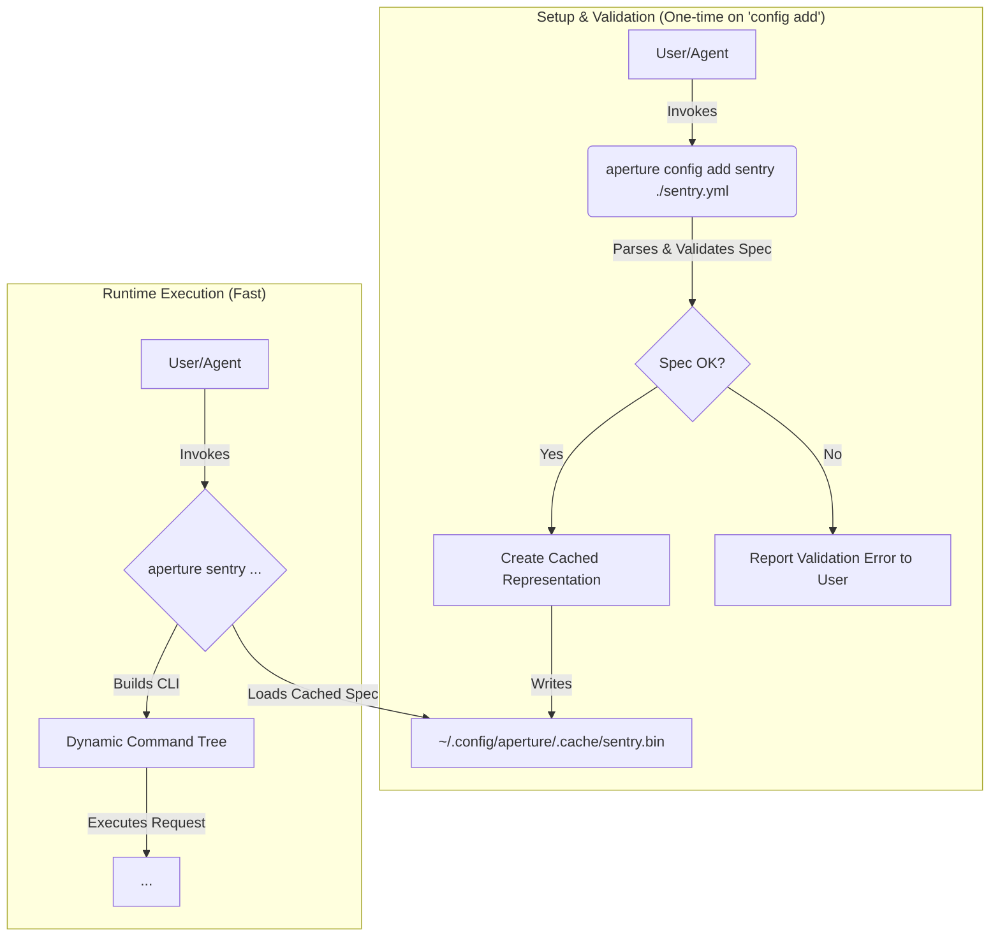

# **Software Design Document: Aperture CLI**

- **Document Version:** 3.0 (Definitive Specification)
- **Product Version:** 0.1.4
- **Status:** Experimental - Core Features Implemented
- **Author:** Claudiu Ivan with Gemini 2.5 Pro

### **Revision History**

- **v3.0 (Current):** Definitive specification incorporating comprehensive critique.
  - **Security:** Formalized the secret management model, linking OpenAPI `securitySchemes` to environment variables via a custom `x-aperture-secret` extension.
  - **Architecture:** Introduced a spec validation and caching mechanism to improve performance and provide early error detection.
  - **Configuration:** Solidified context naming and management. Fully specified the `config add` command, including `--force` and URL-based fetching.
  - **OpenAPI Support:** Provided a definitive list of supported and unsupported features for v1. Refined command generation rules to be more robust.
  - **Documentation:** Made the SDD self-contained by embedding all required schemas. Clarified versioning, roadmaps, and feature specifications.
- **v2.0:** Introduced OpenAPI-native design and agent-facing features.
- **v1.0 - v1.2:** Initial proposals and refinements based on a proprietary schema.

## 1. Overview

**Aperture** is a command-line interface (CLI) that generates a rich, interactive CLI directly from a standard **OpenAPI 3.x specification**. Its primary purpose is to provide a secure, reliable, and introspectable "tool-use" endpoint for autonomous AI agents and automated systems.

By adopting OpenAPI as its native configuration format, Aperture eliminates the need for manual API client coding. It provides a standardized bridge between agentic logic and any API, allowing systems to dynamically gain new capabilities simply by registering an API specification.

## 2. Goals and Scope

### 2.1. Goals

- **OpenAPI-Native:** Directly consume standard OpenAPI 3.x documents as the single source of truth.
- **Dynamic & Performant:** Generate commands at runtime from a pre-validated, cached representation of the API spec to ensure fast startup.
- **Agent-First Design:** Optimize for programmatic use with structured, schema-validated I/O and actionable errors.
- **Secure & Robust:** Enforce a strict separation of configuration from secrets. Build a reliable tool in Rust.

### 2.2. Non-Goals (for Product v1.0)

- **A GUI:** Aperture is exclusively a command-line tool.
- **Full OpenAPI Support:** See §5 for the explicit list of supported features.
- **Interactive Authentication:** User-interactive OAuth2 flows are deferred.
- **Generic Pagination Helper:** Automatic handling of paginated responses is deferred.

## 3. Configuration & Context Management

Aperture manages API specifications via a dedicated configuration directory, following the XDG Base Directory Specification (`~/.config/aperture/`).

### 3.1. Directory Structure

```
~/.config/aperture/
├── specs/
│   ├── sentry.openapi.yml
│   └── stripe.openapi.json
├── .cache/
│   ├── sentry.bin
│   └── stripe.bin
└── config.toml
```

- **`specs/`**: Contains the original OpenAPI specification files provided by the user.
- **`.cache/`**: Contains validated, pre-processed, and cached representations of the specs for fast runtime loading.
- **`config.toml`**: An optional file for global Aperture settings. See Appendix B for the schema.

### 3.2. API Contexts

An **API Context** is a named reference to an API specification. The context name is explicitly provided by the user during registration and is not derived from the filename. This allows for clear versioning (e.g., `sentry-v1`, `sentry-v2`).

### 3.3. Built-in `config` Command Suite

Aperture provides a built-in `config` command to manage API contexts.

| Command                           | Usage Scenario                  | Agent Interaction                                       | Human Interaction                                |
| :-------------------------------- | :------------------------------ | :------------------------------------------------------ | :----------------------------------------------- | ---------------------------------------------- |
| `config add <name> <file_or_url>` | Register or update an API spec. | `generate_spec                                          | aperture config add my-api --from-stdin`         | `aperture config add sentry ./sentry.yml`      |
| `--force`                         | Optional flag for `add`.        | `...                                                    | aperture config add my-api --force`              | Overwrites an existing spec without prompting. |
| `config edit <name>`              | Edit an existing spec.          | N/A (Agents use `add --force`).                         | Opens `$EDITOR` with the spec file.              |
| `config new <name>`               | Create a spec from a template.  | N/A (Agents should generate a full spec and use `add`). | Opens `$EDITOR` with a boilerplate OpenAPI file. |
| `config list`                     | List available API contexts.    | `aperture config list --json`                           | `aperture config list`                           |
| `config remove <name>`            | Remove an API spec.             | `aperture config remove old-api`                        | `aperture config remove old-api`                 |

## 4. Architecture & Performance

### 4.1. Architectural Diagram with Caching



### 4.2. Performance: Validation & Caching

To ensure fast startup, Aperture does not parse the full OpenAPI specification on every invocation. Instead:

1. When `aperture config add` is run, the spec is thoroughly parsed and validated. This includes checking for command collisions and unsupported features.
2. If valid, a lightweight, serialized representation of the command tree and operations is saved to the `.cache/` directory. A **fingerprint** of the spec file (SHA-256 content hash, modification time, and file size) is stored in the cache metadata.
3. On subsequent runs (`aperture <context> ...`), Aperture loads this pre-processed file directly, bypassing the expensive parsing and validation steps. The cache is validated against the spec file fingerprint: if the spec file has been modified since caching, a stale cache error is returned with a suggestion to run `aperture config reinit`.

> **Cache validity invariant:** The cache is valid if and only if the spec file fingerprint matches the stored fingerprint. Fingerprint comparison uses a fast path—modification time and file size are checked first—and only computes the content hash if those match.

### 4.3. Concurrency Safety

Aperture is designed for "agent-first" usage where multiple processes may invoke `aperture` concurrently (e.g., parallel CI/CD pipelines, multiple agents). All cache and configuration I/O provides the following guarantees:

#### Atomic Writes

All file writes use a **temp-file + rename** pattern (`src/atomic.rs`):

1. Data is written to a temporary sibling file (`.filename.random.tmp`).
2. The temp file is atomically renamed to the target path.
3. On failure, the temp file is cleaned up; the target file is never left in a partial state.

This applies to:
- **`ResponseCache::store()`** — response cache entries
- **`CacheMetadataManager::save_metadata()`** — cache metadata JSON
- **`ConfigManager::write_spec_files()`** — spec YAML and cached binary files
- **`ConfigManager::save_global_config()`** — `config.toml`
- **`ConfigManager::set_setting()`** — settings updates

> **Guarantee:** A reader will never observe a partially written file. Concurrent writers to the same path produce one complete file (last writer wins).

#### Advisory File Locking

The response cache directory uses advisory file locking (`fs2`) via a `.aperture.lock` file:

- `ResponseCache::store()` acquires an exclusive lock before writing and cleaning up entries.
- The lock coordinates between cooperating Aperture processes — it does **not** prevent non-Aperture processes from accessing the directory.
- Locks are automatically released when the lock guard is dropped.

> **Note:** Advisory locking is cooperative. Non-Aperture programs writing to the cache directory are not affected by these locks.

#### Cross-Platform Behavior

- **POSIX (Linux, macOS):** `rename(2)` is atomic within the same filesystem. `flock(2)` provides advisory locking.
- **Windows:** `MoveFileEx` with `MOVEFILE_REPLACE_EXISTING` provides atomic same-volume renames. `LockFileEx` provides advisory locking.

## 5. OpenAPI Specification Support (v1.0)

Aperture's v1.0 implementation will support a well-defined subset of the OpenAPI 3.x specification.

| OpenAPI Keyword              | Support Status          | Details                                                                                                                   |
| :--------------------------- | :---------------------- | :------------------------------------------------------------------------------------------------------------------------ |
| `openapi`, `info`, `servers` | **Supported**           | `servers[0].url` is used as the `baseUrl`. Server URL template variables are supported via `--server-var` flag.           |
| `paths`, `operations`        | **Supported**           | The core structure for command generation.                                                                                |
| `tags`                       | **Supported**           | Used as the primary mechanism for command namespacing.                                                                    |
| `operationId`                | **Supported**           | Used as the primary source for subcommand names.                                                                          |
| `components`                 | **Supported**           | Referencing schemas, parameters, etc., via `$ref` is supported.                                                           |
| `parameters` (`in`)          | **Supported**           | `path`, `query`, and `header` are supported.                                                                              |
| `parameters` (`style`)       | **Unsupported**         | Default styles are assumed. Complex serialization is not supported.                                                       |
| `requestBody`                | **Partially Supported** | Only `content` type `application/json` is supported. Other content types (e.g., `multipart/form-data`, `application/xml`) are skipped with warnings in non-strict mode. |
| `responses`                  | **Supported**           | Used to validate successful response bodies.                                                                              |
| `securitySchemes`            | **Partially Supported** | See §6 for the detailed security model. `apiKey` and `http` (bearer, basic, and custom schemes) are supported. `oauth2` and `openIdConnect` are skipped with warnings in non-strict mode. |

Any unsupported keyword or feature encountered during `config add` will result in a clear validation error, preventing the spec from being registered.

### 5.2. Validation Modes

Starting from v0.1.2, Aperture supports two validation modes during `config add`:

1. **Non-Strict Mode (Default):** Accepts specifications with unsupported features but intelligently handles endpoints:
   - Endpoints that support `application/json` alongside unsupported content types remain available
   - Endpoints with at least one supported authentication scheme remain available
   - Only endpoints with NO supported content types or ONLY unsupported auth schemes are skipped with warnings
   - This maximizes API usability while clearly communicating limitations
   
2. **Strict Mode (`--strict` flag):** Rejects specifications that contain any unsupported features. This ensures complete compatibility but may prevent usage of APIs that have mixed endpoint support.

**Example:**
```bash
# Non-strict mode (default) - accepts spec, only skips endpoints with no JSON support
aperture config add my-api ./spec.yaml

# Strict mode - rejects spec if any unsupported features found  
aperture config add --strict my-api ./spec.yaml
```

**Warning Display:**
When endpoints are skipped in non-strict mode, Aperture displays detailed warnings:
```
Warning: Skipping 2 endpoints with unsupported content types (8 of 10 endpoints will be available):
  - POST /upload (multipart/form-data (file uploads are not supported)) - endpoint has no supported content types
  - PUT /binary (application/octet-stream (binary data uploads are not supported)) - endpoint has no supported content types

Warning: Skipping 1 endpoints with unsupported authentication (7 of 8 endpoints will be available):
  - GET /admin - endpoint requires unsupported authentication schemes: oauth2

Use --strict to reject specs with unsupported features.
```

### 5.1. Command Generation Strategy

1. **Namespace from `tags`:** An operation's first `tag` determines its command group (e.g., `tags: [Issues]` -> `aperture sentry issues ...`).
2. **Subcommand from `operationId`:** The subcommand is the kebab-cased `operationId` (e.g., `listProjectIssues` -> `list-project-issues`).
3. **Fallbacks (Robust):**
   - If an operation has no `tags`, it is placed under a `default` top-level command.
   - If it has no `operationId`, the subcommand name is the HTTP method (`get`, `post`).
   - Using dynamic path segments (e.g., `/{id}`) for command names is strictly forbidden.

## 6. Security Model & Secret Management

Aperture enforces a strict separation of configuration (the OpenAPI spec) and secrets.

1. **Declaration:** The API provider defines the required authentication in the `securitySchemes` object of the OpenAPI spec.
2. **Mapping:** The user (or agent) maps the declared scheme to a secret source using a custom `x-aperture-secret` extension.
3. **Resolution:** At runtime, Aperture reads the mapping and resolves the secret's value from the specified source (environment variable in v1.0).

**Example `securitySchemes` with Aperture Extension:**

```yaml
components:
  securitySchemes:
    sentryAuthToken:
      type: http
      scheme: bearer
      # Aperture-specific extension to map this scheme to a secret source
      x-aperture-secret:
        source: env
        name: SENTRY_AUTH_TOKEN
```

This configuration instructs Aperture to use the value of the `SENTRY_AUTH_TOKEN` environment variable for any operation secured by `sentryAuthToken`. If the extension is missing or the environment variable is unset, Aperture will fail with a `Config.SecretNotFound` error.

**Supported Authentication Types:**

1. **API Key** (`type: apiKey`): Supports header, query, or cookie placement
2. **HTTP Bearer** (`type: http`, `scheme: bearer`): Standard Bearer token authentication
3. **HTTP Basic** (`type: http`, `scheme: basic`): Basic authentication with base64 encoding
4. **Custom HTTP Schemes** (`type: http`, `scheme: <custom>`): Any scheme not explicitly rejected (e.g., Token, DSN, ApiKey)

Custom HTTP schemes are treated as bearer-like tokens, resulting in `Authorization: <scheme> <token>` headers.

**Explicitly Unsupported:**
- OAuth2 (all flows)
- OpenID Connect
- HTTP Negotiate (Kerberos/NTLM)
- HTTP OAuth

## 7. Agent-Facing Contracts

### 7.1. Global Agent Flags

| Flag                      | Behavior                                                                                  |
| :------------------------ | :---------------------------------------------------------------------------------------- |
| `--describe-json`         | Prints a JSON manifest detailing all commands and parameters for the current API context. |
| `--json-errors`           | Outputs all errors to `stderr` as a structured JSON object.                               |
| `--dry-run`               | For mutating operations, prints the request that _would_ be sent and exits.               |
| `--idempotency-key <key>` | Sets the `Idempotency-Key` header for safe retries.                                       |

### 7.2. Custom Extensions (`x-aperture-*`)

Aperture uses custom extensions to enrich the OpenAPI spec with agent-specific metadata. See Appendix A for the schemas of these extensions.

- `x-aperture-meta`: Top-level metadata about the API wrapper.
- `x-aperture-operation`: Agent-specific hints for an operation, including `agentDescription` and idempotency configuration.
- `x-aperture-secret`: Maps a `securityScheme` to a secret source.

## 8. Advanced Feature Handling

### 8.1. Pagination

For v1.0, Aperture **does not** provide an automatic pagination mechanism. If an API's `list` operation includes pagination parameters (e.g., `page`, `limit`, `next_cursor`), they will be exposed as standard CLI flags. The agent or user is responsible for making subsequent calls with the appropriate pagination values. A generic helper is a high-priority roadmap item.

### 8.2. Response Validation Failure Policy

Aperture is **strict by default**. If an API returns a successful (2xx) status code but the response body fails to validate against the OpenAPI schema, Aperture will:

1. Exit with a non-zero status code.
2. If `--json-errors` is used, emit a `Response.Validation` error. The error's `context` field will contain the raw response body received from the API.
   This strict policy prevents malformed or unexpected data from propagating into automated systems.

## 9. Roadmap (Post-v1.0 Product)

This SDD describes Product v1.0. Future development will focus on:

- **v1.1:** Introduce a generic pagination helper (`--auto-paginate`). ~~Custom HTTP scheme support~~ (COMPLETED in v0.1.4).
- **v1.2:** Add a `aperture config set <key> <value>` command for managing `config.toml`. Expand command validation and error reporting capabilities.
- **v2.0:** Introduce keychain integration as an additional `SecretSource`. Expand OpenAPI support to include more complex features.

---

## Appendix A: Schemas for Custom Extensions & Agent Contracts

_(This section makes the SDD self-contained by embedding the previously referenced schemas.)_

### A.1. `x-aperture-*` Extension Schemas

```yaml
# Schema for x-aperture-meta (in 'info' object)
x-aperture-meta:
  type: object
  properties:
    description: { type: string }

# Schema for x-aperture-operation (in 'operation' object)
x-aperture-operation:
  type: object
  properties:
    agentDescription: { type: string }
    autoIdempotency: { type: boolean, default: false }
    idempotencyKeyHeader: { type: string, default: "Idempotency-Key" }

# Schema for x-aperture-secret (in 'securityScheme' object)
x-aperture-secret:
  type: object
  properties:
    source: { type: string, enum: ["env"] } # "keychain" is a future option
    name: { type: string }
  required: [source, name]
```

### A.2. Agent Contract Schemas

The JSON output for `--describe-json`, `--dry-run`, and `--json-errors` will conform to well-defined schemas, enabling reliable programmatic parsing. _(These are assumed to be detailed JSON Schema documents as specified in the previous critique's analysis.)_

## Appendix B: `config.toml` Specification

The `config.toml` file provides global configuration for Aperture's behavior.

**Example `config.toml`:**

```toml
# Default timeout for all API requests in seconds.
# Can be overridden by a command-specific flag if implemented.
default_timeout_secs = 30

[agent_defaults]
# If true, all errors will be output in JSON format by default,
# as if --json-errors were always present.
json_errors = true
```

## 9. Phase 3 Architecture: Automation at Scale

### 9.1. Batch Processing System

The batch processing system enables execution of multiple API operations from structured batch files with concurrency control and rate limiting.

#### 9.1.1. Batch Module (`src/batch.rs`)

**Core Components:**

- **`BatchProcessor`**: Main orchestrator for batch execution
- **`BatchFile`**: Structured representation of batch operations
- **`BatchOperation`**: Individual operation within a batch
- **`BatchConfig`**: Configuration for concurrency and rate limiting

**Key Features:**

- **Concurrency Control**: Uses `tokio::sync::Semaphore` to limit concurrent requests
- **Rate Limiting**: Implements `governor` crate for request throttling
- **Error Handling**: Configurable continue-on-error behavior
- **Progress Reporting**: Optional progress display during execution

**Architecture Pattern:**

```rust
BatchProcessor::new(config)
    .execute_batch(spec, batch_file, global_config, base_url, dry_run, format, jq_filter)
    -> BatchResult { results, total_duration, success_count, failure_count }
```

#### 9.1.2. Batch File Format

Supports both JSON and YAML formats with the following structure:

```yaml
metadata:
  name: "Batch Name"
  description: "Batch description"
  version: "1.0"
operations:
  - id: "operation-1"
    args: ["users", "get-user-by-id", "--id", "123"]
    description: "Get user by ID"
    headers:
      X-Custom-Header: "value"
    use_cache: true
```

### 9.2. Response Caching System

The response caching system provides intelligent caching with TTL support for improved performance on repeated requests.

#### 9.2.1. Cache Module (`src/response_cache.rs`)

**Core Components:**

- **`ResponseCache`**: Main cache interface with TTL management
- **`CacheConfig`**: Configuration for cache behavior
- **`CachedResponse`**: Cached response with metadata
- **`CacheKey`**: Unique identifier for cache entries

**Key Features:**

- **TTL Management**: Automatic expiration based on configurable TTL
- **Cache Key Generation**: SHA256 hashes of normalized request parameters
- **Security**: Authentication headers excluded from cache keys
- **Storage**: File-based cache with JSON serialization

**Architecture Pattern:**

```rust
ResponseCache::new(config)
    .get_cached_response(cache_key) -> Option<CachedResponse>
    .store_response(cache_key, response, ttl)
    .cleanup_expired_entries()
```

#### 9.2.2. Cache Integration

Cache integration is seamlessly integrated into the HTTP request executor:

1. **Cache Lookup**: Check for cached response before making HTTP request
2. **Cache Store**: Store successful responses with TTL
3. **Cache Bypass**: Honor `--no-cache` flag and skip caching for errors

### 9.3. Experimental Flag-Based Parameter Syntax

The experimental syntax system provides an alternative command generation approach using flags for all parameters.

#### 9.3.1. Enhanced Command Generation

**Modified Generator (`src/engine/generator.rs`):**

- **`generate_command_tree_with_flags`**: Alternative command generation function
- **Flag-Based Parameters**: Converts all parameters (including path parameters) to flags
- **Backwards Compatibility**: Maintains existing positional parameter support

**Architecture Pattern:**

```rust
if experimental_flags {
    // All parameters become flags: --id 123
    arg.long(param_name).takes_value(true)
} else {
    // Path parameters remain positional: 123
    arg.takes_value(true)
}
```

#### 9.3.2. Command Syntax Comparison

**Traditional Syntax:**
```bash
aperture api my-api users get-user-by-id 123 --include-profile true
```

**Experimental Syntax:**
```bash
aperture api my-api --experimental-flags users get-user-by-id --id 123 --include-profile true
```

### 9.4. Cache Management System

The cache management system provides CLI commands for managing response caches.

#### 9.4.1. Cache Management Commands

**New CLI Commands:**

- **`config clear-cache`**: Remove cached responses
- **`config cache-stats`**: Display cache statistics

**Command Structure:**

```bash
# Clear cache for specific API
aperture config clear-cache my-api

# Clear all caches
aperture config clear-cache --all

# Show cache statistics
aperture config cache-stats my-api
```

#### 9.4.2. Cache Statistics

Provides detailed information about cache usage:

- **Total Entries**: Number of cached responses
- **Valid Entries**: Number of non-expired responses
- **Expired Entries**: Number of expired responses
- **Cache Size**: Total disk space used
- **Hit Rate**: Cache effectiveness metrics

### 9.5. Performance Considerations

#### 9.5.1. Batch Processing Performance

- **Concurrency**: Default limit of 5 concurrent requests (configurable)
- **Rate Limiting**: Optional requests-per-second throttling
- **Memory Usage**: Streaming processing for large batch files
- **Error Recovery**: Configurable failure handling strategies

#### 9.5.2. Cache Performance

- **Cache Hits**: Sub-millisecond response times for cached requests
- **Storage Efficiency**: Compressed JSON with minimal metadata
- **TTL Management**: Efficient expiration without background processes
- **Cleanup**: Automatic removal of expired entries during access

### 9.6. Security Considerations

#### 9.6.1. Cache Security

- **Authentication Exclusion**: Auth headers excluded from cache keys
- **File Permissions**: Cache files use secure permissions
- **Sensitive Data**: Guidelines for avoiding sensitive data caching
- **Cache Isolation**: Per-API cache separation

#### 9.6.2. Batch Security

- **Input Validation**: Batch files validated against schema
- **Resource Limits**: Configurable concurrency and rate limits
- **Error Handling**: Secure error reporting without sensitive data
- **Access Control**: Batch files respect existing authentication

### 9.7. Future Architecture Considerations

Phase 3 architecture lays the foundation for future enhancements:

- **Distributed Caching**: Shared cache across multiple Aperture instances
- **Advanced Batching**: Support for conditional operations and dependencies
- **Plugin System**: Extensible architecture for custom batch processors
- **Stable Flag Syntax**: Migration path for experimental syntax to become default

This architecture supports the project's evolution while maintaining backwards compatibility and performance characteristics.

